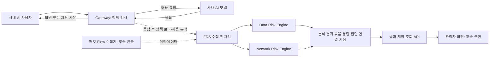

# 사내 AI Gateway + FDS 백엔드

사내에 설치한 AI를 사용하는 환경의 기본 구조입니다. **Gateway는 요청을 통제하고 전달하며, FDS는 별도 경로로 받은 기록을 분석합니다.** FastAPI + SQLite, Python 3.12 이상을 사용합니다.

## 전체 흐름



- Gateway는 모델 허용 목록과 입력 크기를 검사합니다. 허용 요청만 사내 모델 어댑터를 호출하며, 내용의 안전성을 판단하는 모델 검사는 아직 하지 않습니다.
- FDS는 요청 기록이 들어오면 최근 5분/1시간 집계를 만들고 두 종류의 엔진을 병렬 호출합니다. 5분이나 1시간이 끝날 때까지 기다리는 배치가 아닙니다.
- FDS 결과가 Gateway 정책을 자동 변경하지 않습니다. 즉시 요청 통제와 사후 분석은 별개입니다.
- 기본 탐지 모델은 `pending`, `score: null`, 통합 위험 등급은 `unassessed`입니다. 미분석은 정상 판정이 아닙니다.

## 실행

저장소 루트에서 PowerShell:

```powershell
cd backend
py -3.12 -m venv .venv
.\.venv\Scripts\python.exe -m pip install -r requirements-dev.txt
```

아래 세 명령을 각각 별도 터미널에서, 모두 `backend` 폴더 기준으로 실행합니다.

```powershell
# 터미널 1: FDS
.\.venv\Scripts\python.exe -m uvicorn app.main:app --host 127.0.0.1 --port 8000
# 터미널 2: 사내 AI 연결 테스트용 모형
.\.venv\Scripts\python.exe -m uvicorn app.demo_model:app --host 127.0.0.1 --port 8002
# 터미널 3: Gateway
.\.venv\Scripts\python.exe -m uvicorn app.gateway:app --host 127.0.0.1 --port 8001
```

| 서비스 | API 문서 | 기본 DB |
|---|---|---|
| FDS | http://127.0.0.1:8000/docs | `data/backend.sqlite3` |
| Gateway | http://127.0.0.1:8001/docs | `data/gateway.sqlite3` |
| 테스트용 AI | http://127.0.0.1:8002/docs | 없음 |

`demo_model`은 고정 문장을 반환하는 통신 확인용 서버입니다. 실제 AI 추론을 하지 않으며 Gateway 응답에 `model_mode: demo`가 표시됩니다.

## 요청 예시

Gateway Swagger의 `POST /api/v1/chat`에서 다음 내용을 실행하세요.

```json
{
  "user_id": "employee-1",
  "device_id": "pc-1",
  "model": "local-demo",
  "text": "회의록을 요약해 주세요.",
  "input_origin": "direct_user"
}
```

허용 요청은 HTTP 200과 답변을 반환합니다. 모델을 `unapproved-model`로 바꾸면 403으로 차단하며 모델을 호출하지 않습니다. 모델 타임아웃은 504, 모델 오류/잘못된 응답은 502입니다.

반환된 `request_id`로 Gateway의 `/api/v1/requests/{request_id}`와 FDS의 `/api/v1/assessments/{request_id}`에서 같은 요청의 정책 기록과 분석 결과를 확인할 수 있습니다. FDS는 응답 후 처리하므로 결과가 잠시 후 나타날 수 있습니다. 응답의 `fds_delivery: pending`은 발송 예약 상태이고, 최신 전송 상태는 Gateway 상세 조회에서 확인합니다. `delivered`는 FDS API 처리 완료이며 모델 분석 완료를 의미하지 않습니다.

## 구성과 API

| 파일 | 역할 |
|---|---|
| `app/gateway.py` | Gateway 앱, 정적 정책, 요청 처리 |
| `app/gateway_clients.py` | 사내 모델·FDS HTTP 연결 인터페이스 |
| `app/contracts.py` | Gateway/FDS/모델 간 계약 |
| `app/demo_model.py` | 테스트용 고정 응답 서버 |
| `app/main.py`, `app/api.py` | FDS 앱과 API |
| `app/collection.py` | 수집, 사용자·세션 연계, 최근 Window, 병렬 분석 |
| `app/services.py` | 집계 및 대시보드 통계 |
| `app/engines.py` | Data/Network 엔진 Protocol과 미연결 구현 |
| `app/schemas.py`, `app/repository.py` | 데이터 계약, 저장소, 트랜잭션, 중복 처리 |

Gateway API:

- `POST /api/v1/chat`: 정책 검사 → 사내 AI 호출 → 별도 FDS 전달
- `GET /api/v1/requests`, `GET /api/v1/requests/{request_id}`: 정책·모델 처리·FDS 전달 상태
- `GET /health`: 설정 모드 확인. 의존 서비스의 준비 상태 검사와는 다릅니다.

FDS API:

- `POST /api/v1/ingest/gateway`: 로그와 프롬프트 수집, 집계, 엔진 호출
- `GET /api/v1/gateway-audits`: 수집된 정책 로그
- `GET /api/v1/assessments`, `GET /api/v1/assessments/{event_id}`: 요청별 Data 1개 + Network 5분/1시간 2개 결과 묶음
- `POST / GET /api/v1/network-sessions`: 네트워크 세션 등록/조회
- `POST / GET /api/v1/ai-usage-events`: AI 사용 이벤트 등록/조회
- `POST / GET /api/v1/behavior-windows`: 지정 구간 집계 생성/조회
- `POST /api/v1/data-risk/analyze`: 독립적인 프롬프트 분석
- `POST /api/v1/network-risk/analyze/{window_id}`: 독립적인 Window 분석
- `GET /api/v1/risks`, `GET /api/v1/risks/{risk_id}`: 엔진 결과 목록/상세
- `GET /api/v1/dashboard/summary`: 수집·분석 건수와 완료 점수 평균
- `GET /health`: DB 연결과 엔진 종류 확인

목록은 `user_id`, `limit`(기본 50, 최대 200), `offset`을 지원합니다. 사용자 필터는 접근 제어가 아닙니다. 대시보드 평균은 완료된 엔진 호출 점수의 단순 평균이며 통합 위험 등급이 아닙니다.

FDS 수집은 관련 레코드를 한 트랜잭션으로 저장합니다. 같은 이벤트 ID와 같은 내용의 재전송은 기존 결과를 반환하며, 다른 내용을 같은 ID로 보내면 409입니다. 재전송으로 모델을 재분석하지 않습니다. 입력 오류는 422, 없는 결과는 404입니다.

## 모델 연결

**사내 생성 AI:** `ModelClient.generate()`를 실제 모델 API에 맞게 구현하거나 현재 HTTP 계약에 맞는 래퍼를 둡니다. 기본 계약은 `POST /generate`, 요청 `{model, text, input_origin}`, 응답 `{text, mode: "model"}`입니다. 자체 정의한 계약으로 Ollama/vLLM 등에 바로 호환되는 API는 아닙니다. 생성 AI와 FDS 위험 탐지 모델은 다른 역할입니다.

**FDS 탐지 모델:** `DataRiskEngine.analyze()` / `NetworkRiskEngine.analyze()` 구현을 `create_app()`에 주입합니다. Data는 민감정보·업무 외 오남용·토큰 낭비/모델 추출·모델 교란, Network는 N1~N6 항목입니다. 두 엔진 종류는 병렬 호출하고 같은 Network 엔진의 5분/1시간 분석은 순차 호출합니다. 여러 HTTP 요청 간 동시 호출 안전성은 어댑터에서 관리해야 합니다.

점수는 0~100 계약입니다. 분류 확률을 전체 위험 점수와 동일시하지 마세요. `input_origin`을 유지해 외부 문서·도구 출력을 직접 사용자 지시와 구분합니다. 엔진 실패는 `error`로 남고 다른 엔진 결과는 보존됩니다. 원문을 근거 문자열에 그대로 복사하지 않는 어댑터를 작성해야 합니다.

**통합 판단:** 결과 묶음과 `fusion_status`, `final_grade`, `reason` 응답 틀만 있습니다. 현재 `fusion_status: pending`, `final_grade: unassessed`이며 등급 기준과 Gateway 차단 피드백은 후속 구현 영역입니다.

## 환경 변수

PowerShell에서 서버 시작 전 `$env:변수명 = '값'`으로 지정합니다. `.env` 파일을 자동으로 읽지 않습니다.

| 변수 | 기본값 |
|---|---|
| `GATEWAY_ALLOWED_MODELS` | `local-demo` (쉼표 구분) |
| `GATEWAY_MAX_PROMPT_BYTES` | `8192` (UTF-8 바이트) |
| `MODEL_BASE_URL` | `http://127.0.0.1:8002` |
| `FDS_BASE_URL` | `http://127.0.0.1:8000` |
| `MODEL_TIMEOUT_SECONDS` | `30` |
| `FDS_TIMEOUT_SECONDS` | `10` |
| `GATEWAY_DATABASE_PATH` | `data/gateway.sqlite3` |
| `DATABASE_PATH` | `data/backend.sqlite3` |
| `CORS_ORIGINS` | `http://localhost:3000,http://localhost:5173` (FDS API) |

HTTP 목적지는 운영자 설정으로 고정합니다. 사용자 요청으로 URL을 받지 않으며 외부 프록시 환경 변수와 리다이렉트를 사용하지 않습니다. 타임아웃은 HTTP 작업 단위입니다.

## 현재 범위와 제한

- 로컬 개발용입니다. 사용자·단말 ID는 요청 본문을 사용하는 데모 식별값입니다. SSO, 자료 접근 권한, 서비스 간 인증, 관리자 권한은 미구현입니다. 실제 서비스에서는 검증된 로그인에서 식별자를 가져와야 합니다.
- Gateway는 이 API를 통과하는 요청에 적용됩니다. 모델 서버 직접 접속을 막는 네트워크 구성, 투명 프록시/TLS 가로채기는 포함하지 않습니다.
- FDS 전달은 응답 후 프로세스 내 `BackgroundTasks`로 수행합니다. 영속 큐·자동 재시도·스케줄러는 없습니다. 프로세스 종료 시 미전송 작업이 유실되고 `pending`이 남을 수 있습니다. FDS 전송 실패는 모델의 성공 응답을 실패로 바꾸지 않으며 `failed`로 기록합니다. 타임아웃 후 FDS 처리가 완료될 가능성도 있습니다. 운영 단계에는 보호된 이벤트 큐와 재시도·상태 확인이 필요합니다.
- 프롬프트·답변 원문은 DB에 저장하지 않습니다. 프롬프트는 분석 동안 메모리와 Gateway→FDS 요청에 포함됩니다. 기록만으로 원문 분석을 재실행할 수 없습니다. 저장된 요청 지문은 중복 확인용 SHA-256이며 원문 암호화 저장물이 아닙니다.
- Gateway 세션은 `source: gateway_application`이고 바이트 수는 완료 요청/응답 텍스트의 UTF-8 크기 추정입니다. 패킷 계측값이 아니며 실패 요청의 실제 전송량은 알 수 없어 0으로 둡니다. 패킷/Flow 수집기는 별도 연결하고 동일 통신을 중복 집계하지 않도록 상관관계를 맞춰야 합니다.
- 최근 Window는 요청 시작 시점 기준 이미 저장된 기록과 이번 요청을 포함합니다. 늦게 도착하거나 동시 처리 중인 기록은 기존 스냅샷에 자동 반영되지 않습니다. 수동 Window는 `[start, end)`이며 세션 전체 바이트를 시작 시각에 귀속합니다.
- 스트리밍·대화 이력·파일 업로드·응답 검사·실제 ML 모델·자동 차단 피드백·대시보드 화면은 후속 구현 영역입니다. 자료 민감도와 이용 권한에 따른 정책도 별도 설계해야 합니다.
- SQLite JSON 저장소와 메모리 집계는 기본 틀입니다. 대규모 데이터에는 정규화 DB·시간 인덱스·별도 작업 큐가 필요합니다.

## 검증

```powershell
.\.venv\Scripts\python.exe -m pytest -q
# 임시 포트로 서버 3개를 실행해 HTTP 통신을 확인하고 종료
.\.venv\Scripts\python.exe examples/smoke_gateway.py
```

`examples/demo.py`는 기존 FDS 단독 API 예제입니다. 테스트 데이터는 임시 위치 또는 Git에서 제외한 `data/` 아래에 저장됩니다.
