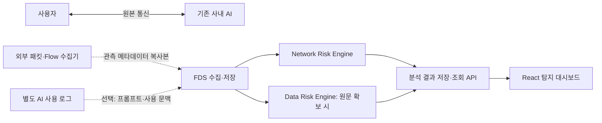

# Out-of-Path FDS 백엔드

**원본 트래픽은 그대로 흐르고, FDS는 별도로 수집한 복사본을 사후 분석합니다.** 사용자와 AI 사이에서 요청을 전달하거나 허용·차단하지 않습니다. FastAPI + SQLite 기반 백엔드 기본 틀입니다.


```mermaid
flowchart LR
    U[사용자] <-->|원본 통신| AI[기존 사내 AI]
    C[외부 패킷·Flow 수집기] -.->|관측 메타데이터 복사본| F[FDS 수집·저장]
    L[별도 AI 사용 로그] -.->|선택: 프롬프트·사용 문맥| F
    F --> N[Network Risk Engine]
    F --> D[Data Risk Engine: 원문 확보 시]
    N --> R[분석 결과 저장·조회 API]
    D --> R
    R --> UI[React 탐지 대시보드]
```

수집기는 미러링된 트래픽이나 저장된 캡처를 읽어 API 계약에 맞는 JSON으로 전달하는 외부 구성 요소입니다. 이 저장소가 NIC에서 패킷을 캡처하거나 PCAP 파일을 직접 해석하지는 않습니다. 수집기를 원본 요청 경로와 분리해야 FDS 장애나 분석 지연이 원본 AI 통신을 멈추지 않습니다.

## 현재 구현

관측 세션·AI 사용 로그 수신, 사용자·단말·시간 연결 검증, 사용자·단말별 고정 5분 집계, Data/Network 엔진 연결, 재전송 중복 방지, 구간별 결과·통계 조회를 구현했습니다. 한 서버/DB는 한 회사 전용입니다.

Regression 프롬프트 모델(TF-IDF + LogisticRegression 네 분류기, 임계값 0.45 초과)과 [`model/network`](../model/network/)의 XGBoost Network 모델을 연결했습니다. **사용자·단말별 고정 5분 구간**에서 **프롬프트 최고 점수(60점) + 그 사용자의 네트워크 점수 × 0.4(40점)**로 통합합니다. 네트워크 모델이 사용자별 5분 창으로 학습됐기 때문입니다(학습 창 ID `..._user_001_w02`). 회사 화면은 같은 시간대 사용자 구간의 등급을 셀 뿐 회사 점수를 따로 만들지 않습니다. 점수는 보안 담당자의 검토 우선순위이며 위반 확정이 아닙니다. 구간 내 프롬프트가 하나라도 미판정·오류거나 네트워크가 미완료면 통합 점수·등급은 `null`입니다. `confidence`도 정의가 없어 `null`입니다. Stub 엔진은 미판정입니다. 개별 Assessment는 프롬프트 결과와 `risk_window_id`를 제공하고 구간 결과는 별도 조회합니다. v0.6~0.7의 회사 전체 합산 구간(`company_assessment`)은 삭제하지 않고 보존하며 `/company-windows`로 읽기만 할 수 있습니다. 상세 계약은 [통합 등급 API](grade-api-contract.md)를 참고하세요.

## 설치·실행

Python 3.12와 Git이 설치된 Windows에서 저장소 루트 기준:

```powershell
cd backend
py -3.12 -m venv .venv
.\.venv\Scripts\python.exe -m pip install -r requirements-dev.txt
.\.venv\Scripts\python.exe -m uvicorn app.main:app --host 127.0.0.1 --port 8000
```

백엔드는 **FDS 서버 하나**를 실행합니다. 대시보드는 별도 터미널에서 `frontend`의 `npm ci`, `npm run dev`로 실행합니다. [프론트엔드 실행 안내](../frontend/README.md)를 참고하세요.

- API 테스트 화면: http://127.0.0.1:8000/docs
- 상태: http://127.0.0.1:8000/health
- 기본 DB: `backend/data/passive-fds.sqlite3`
- DB 변경: 서버 시작 전 `$env:DATABASE_PATH = '원하는파일경로'`
- 브라우저 조회 허용 주소: `CORS_ORIGINS` (기본 `http://localhost:3000,http://localhost:5173`)

기본 실행은 [`model/prompt/regression`](../model/prompt/)의 모델을 서버 시작 시 한 번 불러옵니다. 요청마다 학습하지 않습니다. `/health`의 `data_engine: RegressionDataRiskEngine`과 `prompt_model_version`으로 연결 상태를 확인합니다. 모델 파일 누락·해시 불일치·scikit-learn 버전 불일치 시 시작을 실패시키며 Stub으로 몰래 바꾸지 않습니다. 모델 없이 수집 기능만 확인하려면 시작 전에 `$env:PROMPT_ENGINE = 'stub'`을 지정하고, 실제 모델로 복귀하려면 `Remove-Item Env:PROMPT_ENGINE` 후 재시작합니다. 이전 XGBoost 모델은 `PROMPT_ENGINE=all-in-one`으로 선택할 수 있습니다. 다른 모델 폴더는 해당 엔진 형식에 맞춰 `PROMPT_MODEL_DIR`로 지정합니다. 이전 환경 설정이 남아 있다면 `PROMPT_ENGINE`을 `regression`으로 바꾸고 `PROMPT_MODEL_DIR`도 새 폴더로 바꾸거나 해제한 뒤 재시작하세요.

## 관측 자료 전송

### 이벤트 발생 즉시 전송 (권장)

`POST /api/v1/ingest/events`는 세션 종료를 기다리지 않습니다. 수집기나 사내 AI 앱의 별도 로그 전송 경로에서 요청 발생 시 아래와 같이 관측 이벤트를 보냅니다.

```json
{
  "id": "event-001",
  "session_id": "ongoing-session-001",
  "user_id": "employee-1",
  "device_id": "pc-1",
  "occurred_at": "2026-10-04T10:00:00+09:00",
  "destination": "local-ai.internal",
  "source": "application_log",
  "provider": "internal-ai",
  "channel": "api",
  "bytes_sent": 100,
  "bytes_received": 0,
  "prompt": {"text": "회의록을 요약해 주세요.", "input_origin": "direct_user"}
}
```

같은 통신의 다음 이벤트는 같은 `session_id`와 새로운 `id`를 사용합니다. 재전송만 기존 이벤트 ID와 동일한 내용을 사용합니다. 바이트는 **이번 관측의 증가량**이며 누적 전송량을 반복해서 보내면 안 됩니다. 같은 세션의 이벤트들은 바이트·요청 수는 누적하되 세션 수는 한 번만 셉니다. 캡처 경로와 이벤트 경로에 같은 트래픽을 중복 등록하지 마세요.

Network 모델 입력용 선택 항목: `packets_sent`, `packets_received`(증가량), `request_bytes`(HTTP 본문 크기, 생략 시 `bytes_sent`), `file_count`, `process_name`, `tenant`, `completed_at`(응답 완료 시각), `retry_after_block`. `provider`가 있을 때만 AI 사용 로그 항목을 받습니다(패킷 수 제외). 모델은 AI 사용 로그가 있는 5분 구간만 점수를 내며, 로그 없는 구간과 60분 구간은 `pending`입니다. 자세한 피처 정의는 [model/network README](../model/network/README.md#백엔드-연결)를 참고하세요.

`provider`와 `prompt`는 선택 항목입니다. 프롬프트가 있으면 `source: application_log`와 `provider`가 필요합니다. 네트워크 메타데이터만 있는 경우에는 두 필드를 생략할 수 있습니다. 내부 저장용 관측 ID와 원래 `session_id`를 분리하며, 대시보드는 원래 세션 ID를 보여줍니다. 기본 세션 조회의 `parent_session_id`로 원래 세션을 확인할 수 있습니다.

자료 저장 후 개별 프롬프트를 분석하고 해당 사용자·단말의 5분 네트워크를 갱신합니다. 10:00~10:05처럼 고정된 반개구간을 사용하며 입력마다 잠정 결과를 갱신합니다. 종료 전 `phase: open`, 종료 후 `closed`입니다. 백그라운드 작업은 종료 표시와 미처리 네트워크 재계산을 수행합니다. 60분 별도 추론은 호출하지 않고 1시간 이력은 네트워크 입력 피처로 반영합니다.

대시보드는 `GET /api/v1/dashboard/stream`의 SSE changed 알림을 받아 `/dashboard/risk-windows`를 재조회합니다. Assessment 및 위험 구간 INSERT/UPDATE 때 DB 변경 번호가 올라갑니다. `WindowRepository._refresh_window_fusion()`이 최고 프롬프트를 선택하고 `fuse_parts()` → `rs.integrate()`로 통합합니다. 최신 입력 버전과 일치하는 네트워크 결과만 저장합니다. SSE는 변경 번호만 전송하고 프록시의 응답 버퍼링은 꺼야 합니다.

수집 API 응답은 전체 분석 후 반환됩니다. 원본 AI 통신과 분리된 수집기에서 전송하고, AI 요청 경로가 이 API의 응답을 기다리게 하지 마세요. 큐·자동 재시도·추론 시간 제한·부하 제어는 후속 구현 대상입니다. 처리 중 프로세스가 종료되면 같은 이벤트를 재전송해야 하며, 저장된 부분 결과를 유지하고 나머지를 확정합니다.

```powershell
.\.venv\Scripts\python.exe examples/event_demo.py
```

### 시연 영상용 다중 사용자 시나리오 (`examples/video_demo.py`)

번호가 붙은 가상 사용자 10명(`user-01`~`user-10`, 단말 `pc-01`… `laptop-05`)의 관측 기록만 `POST /api/v1/ingest/events`로 보냅니다. 실제 AI 요청·네트워크 전송은 하지 않으며 점수·등급을 보내지 않습니다. 각 날짜의 KST 10:00·10:05·10:10·10:15 구간에 사용자마다 정해진 패턴을 보내고, 전송 후 `GET /api/v1/risk-windows/{id}`의 실제 결과를 표로 출력합니다.

| 패턴(목표) | 입력 의도 |
|---|---|
| normal | 업무 요약 3건, 요청당 3~4KB, 파일·재시도 없음 |
| caution_repeat (caution) | 브라우저·스크립트가 번갈아 15초 간격 6건, 반복 출력 요구 프롬프트 1건 |
| caution_prompt (caution) | 정상 업무 2건 사이 지시 무시 유도 프롬프트 1건, 정상 전송량 |
| warning | 자동화 스크립트 2개가 12초 간격 22건(응답 겹침), 요청당 9KB, 응답 수집 의도 프롬프트 |
| danger | 복합 위험 프롬프트, 요청당 0.6~0.9MB·파일 6~8개, 테넌트·미승인 목적지 전환, 차단 후 재시도 |

| 사용자 | 10:00 | 10:05 | 10:10 | 10:15 | 줄거리 |
|---|---|---|---|---|---|
| user-01 | normal | normal | normal | normal | 평범한 사무 업무만 계속 |
| user-02 | normal | caution_repeat | normal | | 잠깐 반복 요청 후 정상 복귀 |
| user-03 | normal | | warning | normal | 자동화 스크립트를 한 차례 돌림 |
| user-04 | normal | caution_repeat | warning | danger | 점점 위험해지다 대량 유출 시도 |
| user-05 | | caution_prompt | | caution_repeat | 지시 무시 시도와 반복 요청 |
| user-06 | | | | danger | 갑자기 대량 유출 시도 |
| user-07 | | warning | warning | | 자동화 수집을 연속 실행 |
| user-08 | | | normal | | 한 번 짧게 사용 |
| user-09 | caution_repeat | caution_repeat | caution_repeat | | 반복 요청을 계속 |
| user-10 | danger | normal | | | 출근 직후 유출 시도 후 정상 업무 |

날짜를 여러 개 주면 두 번째 날짜부터 계획을 한 칸씩 돌려(둘째 날 user-01은 위 표 user-02의 계획) 사용자마다 날짜별 이력이 달라집니다.

```powershell
# 창 1 (backend 폴더)
.\.venv\Scripts\python.exe -m uvicorn app.main:app --port 8000
# 창 2 (backend 폴더). 같은 날짜를 다시 쓰면 기존 구간과 섞이므로 중단됩니다.
.\.venv\Scripts\python.exe examples\video_demo.py --date 2026-10-01
.\.venv\Scripts\python.exe examples\video_demo.py --date 2026-10-01 2026-10-02   # 여러 날짜
.\.venv\Scripts\python.exe examples\video_demo.py --date 2026-10-01 --detail      # 구간별 점수 구성 상세
```

출력: 구간별 표(날짜, 시간, 사용자, 단말, 패턴, 목표·실제 등급, 통합·프롬프트·네트워크 점수, 판정 유형, 일치 여부), 날짜별 사용자 요약(`/dashboard/users`), 회사 시간대 요약(`/dashboard/company-slots`). `--detail`은 구간마다 `risk_window_id`, 프롬프트 분석 건수, 최고 점수 capture ID, 네트워크 점수 구성을 추가로 출력합니다.

**패턴 이름은 목표일 뿐 결과를 보장하지 않습니다.** 네트워크 모델은 24개 행동 피처의 조합으로 판정하므로 `bytes_sent`·`file_count`를 키워도 반드시 위험 유형이 되지 않고, 작은 입력이 위협으로 판정될 수도 있습니다(예: 짧은 정상 요청 2건만 보내는 시험 패턴이 N5로 판정돼 정상 등급 안에서 네트워크 24점이 나온 적이 있어 시연 패턴에서 뺐습니다). 같은 사용자의 최근 1시간 기록도 피처로 쓰므로 앞선 구간과 DB 상태에 따라서도 달라집니다. 목표와 실제가 다르면 "다름"으로 표시하고 종료 코드 1을 반환합니다. 실제 등급이 미판정(null)이어도 성공으로 보지 않습니다. 스크립트는 값을 자동 조정하거나 등급을 덮어쓰지 않습니다.

가상 데이터이므로 실제 운영에서는 실제 수집 범위와 사용자 규모로 다시 검증해야 합니다.

## 조회 API

| Method | 경로 | 역할 |
|---|---|---|
| POST | `/api/v1/ingest/events` | 세션 종료 없이 관측 이벤트 수신·분석 |
| GET | `/api/v1/dashboard/stream` | 수신·부분 결과·완료 시 SSE 변경 알림 |
| POST | `/api/v1/ingest/captures` | 관측 자료 저장 후 사후 분석 |
| GET | `/api/v1/captures` | 수집 기록·프롬프트 확보 상태 |
| GET | `/api/v1/assessments` | 캡처별 분석 묶음 |
| GET | `/api/v1/assessments/{capture_id}` | 개별 프롬프트 결과 + risk_window_id |
| GET | `/api/v1/risk-windows`, `/api/v1/risk-windows/{window_id}` | 사용자·단말 5분 통합 결과(`user_id`, `date` 필터). `prompt_scores`와 `network_score_breakdown` 포함 |
| GET | `/api/v1/dashboard/risk-windows` | 화면용 사용자 구간 목록. `user_id`, `date`(KST 날짜), `start`(같은 시간대) 필터 |
| GET | `/api/v1/dashboard/users?date=` | 사용자별 요약: 구간 수, 등급별 구간 수, 가장 높은 등급 구간(점수 합산 아님). 높은 등급 순 |
| GET | `/api/v1/dashboard/dates` | 구간이 있는 KST 날짜 목록과 날짜별 구간·사용자 수 |
| GET | `/api/v1/dashboard/company-slots?date=` | 회사 시간대 요약: 사용자 수, 등급별 구간 수, 미판정·오류 수, 최고 등급 구간. 회사 점수를 합산·평균하지 않음 |
| GET | `/api/v1/company-windows`, `/api/v1/company-windows/{id}` | (이전 버전, 읽기 전용) 보존된 회사 전체 합산 구간 |
| POST / GET | `/api/v1/network-sessions` | 세션 개별 등록/조회 |
| POST / GET | `/api/v1/ai-usage-events` | AI 사용 이벤트 개별 등록/조회 |
| POST / GET | `/api/v1/behavior-windows` | 지정 구간 집계 생성/조회 |
| POST | `/api/v1/data-risk/analyze` | 독립 프롬프트 분석 |
| POST | `/api/v1/network-risk/analyze/{window_id}` | 독립 행동 집계 분석 |
| GET | `/api/v1/risks`, `/api/v1/risks/{risk_id}` | 엔진 결과 목록/상세 |
| GET | `/api/v1/dashboard/summary` | 수집량·분석 건수·완료 점수 평균 |
| GET | `/api/v1/dashboard/events` | 캡처별 화면 데이터와 전체 건수 |
| GET | `/api/v1/dashboard/explanation?capture_id=...` 또는 `?window_id=...` | 저장된 분석 근거 요약 |

목록은 `limit`(기본 50, 최대 200), `offset`을 지원하며 개별 관측 목록만 `user_id` 필터를 제공합니다. `/network-sessions`, `/ai-usage-events`의 개별 등록과 직접 프롬프트 테스트는 구간 자동 통합에 포함하지 않습니다. 자동 분석은 `/ingest/captures`, `/ingest/events`에서 실행합니다. 대시보드 평균은 통합 완료 사용자 구간을 한 번씩 집계하며 `risk_window_count`, `graded_window_count`를 사용합니다. React 화면은 `dashboard/risk-windows`로 최근 구간을 조회합니다.

## 수집·분석 처리 기준

기존 캡처 경로는 완료된 세션을 받고 새 이벤트 경로는 시점별 증가량을 받습니다. 두 경로는 관측 ID 공간을 공유하므로 수집기별 접두사를 권장합니다. 재전송은 같은 ID와 내용을 사용해야 합니다. 동일 ID의 내용 변경이나 기존 세션/이벤트 ID 충돌은 409, 잘못된 연결/입력은 422, 없는 결과는 404입니다. 기존 기록을 수정하는 누적 Flow 갱신은 미지원입니다.

관측 자료와 `processing` 상태를 먼저 커밋한 뒤 분석합니다. 앞선 모델 실행이 느려도 이미 수집된 기록은 다음 집계에 포함될 수 있습니다. 세션과 이벤트는 같은 조회 시점으로 읽습니다. 분석 중 프로세스가 종료됐다면 수집기가 같은 자료를 재전송해 재시도할 수 있습니다. 동시 재전송으로 모델이 중복 실행될 수는 있지만 결과는 한 번만 저장됩니다.

수집 API는 분석까지 수행한 뒤 응답합니다. 이것은 원본 AI 통신과 분리된 수집기→FDS 통신입니다. 수집기 버퍼·영속 작업 큐·자동 재시도는 별도 구현 대상입니다.

AI 사용 로그가 있으면 요청 발생 시각, 없으면 세션 시작 시각으로 고정 5분 구간을 선택합니다. 전송량도 같은 시각에 귀속하며 긴 세션의 바이트를 임의로 분할하지 않습니다. 5분 피처는 같은 사용자·같은 단말 기록, 최근 1시간 이력 피처(`user_*_observed_1h`)는 같은 사용자의 모든 단말 기록으로 계산합니다(다른 사용자 기록은 포함하지 않음). 지연 수신은 원래 구간과 같은 사용자의 이후 1시간 이력에 영향을 받는 구간을 재계산합니다. 서버 재시작 시 기존 관측·저장된 프롬프트 결과로 사용자 구간을 구성하고 네트워크를 재계산합니다(이전 회사 구간 기록은 보존). 개인별 기준선(평소 패턴 비교)은 사용하지 않으며 모든 사용자에게 같은 모델을 씁니다.

## 프롬프트·모델 연결

원문은 앞뒤 공백·개행을 보존해 모델에 전달하며 DB에는 저장하지 않습니다. 수집 입력 상한은 131,072자, 현재 Data 모델 계약은 16,384자입니다. 모델 상한을 넘는 관측은 메타데이터를 저장하고 `prompt_too_large`로 표시합니다. 수집 상한보다 큰 원문은 수집기에서 생략하고 메타데이터만 보내야 합니다. 원문이 없거나 비어 있으면 Data 모델을 호출하지 않습니다.

`app/prompt_engine.py`가 `request.text`를 모델에 전달합니다. 받은 `Regression.ipynb`와 같은 NFKC·개행 정리·앞뒤 공백 제거, 공통 TF-IDF(`char_wb`, 3~5글자, 최대 150,000개 특징), 네 LogisticRegression 분류기(`C=3`, `max_iter=1000`), `probability > 0.45` 판정을 사용합니다. 0.45와 같으면 미탐지입니다. 원본의 배치 JSON을 직접 반환하는 대신 기존 `RiskResult` 및 대시보드 응답 구조로 연결합니다. 네 항목은 `AI_steal`, `prompt_injection`, `abuse_act`, `token_waste_repeat`이며 복수 탐지가 가능합니다. 모든 항목 미탐지는 실제 안전·정책 준수를 보장하지 않습니다. `input_origin`은 결과에 보존하지만 기존 모델은 문장만 분류하므로 출처·업무 맥락을 학습 특징으로 사용하지 않습니다.

분류 결과 예시(형식 설명용 숫자):

```json
{"code":"AI_steal","name":"인공지능 증류","status":"complete","score":null,"detected":true,"probability":0.91,"threshold":0.45,"reason":"라벨 정의이며 개별 판단 근거는 미제공"}
```

`status: complete`는 점수가 없어도 분류 완료를 뜻할 수 있습니다. 항목별 확률·위험 점수는 구분합니다. 프롬프트 엔진 전체는 네 항목의 탐지 여부로 최대 60점의 정책 점수를 계산해 `RiskResult.score`에 넣고 `score_max: 60`, `scoring_policy: prompt-product-base10-v1`를 함께 제공합니다. 각 항목의 `score`는 여전히 null이며 기여도는 제공하지 않습니다. 기존 점수형 엔진 출력과 과거 DB 기록은 계속 읽을 수 있습니다. 원문·예외 상세는 저장하지 않으며 표시되는 설명은 라벨 정의입니다.

실제 모델 → 수집 API → 저장 → 화면 연결 확인:

```powershell
.\.venv\Scripts\python.exe examples/prompt_model_demo.py
```

받은 원본에는 모델 체크포인트가 없어 승인된 고유 문장 546,973건으로 한 번 학습해 저장했습니다. 빈 항목 라벨은 0으로 채우지 않고 해당 분류기의 학습에서 제외합니다. 추가 보강 실험·튜닝·임계값 조정은 적용하지 않았습니다. 모델과 전처리 파일·해시는 `model/prompt/regression/manifest.json`에 있습니다. 학습 데이터와 원본 노트북은 이 저장소에 복제하지 않았습니다. 동일 원본을 가진 팀원은 다음과 같이 새 폴더에 재생성할 수 있습니다.

```powershell
.\.venv\Scripts\python.exe scripts/train_regression_prompt_model.py --source 'C:\경로\All_in_one(regression)' --output '../model/prompt/regression-retrained'
```

학습 도구는 검토한 원본 노트북의 SHA-256을 확인하고 설정·전처리·학습 정의 셀만 실행합니다. CSV 승인 해시·수량·라벨·중복 검사와 학습 수렴 검사를 유지합니다. 원본 CSV 수정, 전체 Run All, 테스트 기반 튜닝은 하지 않습니다. 소스가 바뀌면 해시만 바꾸지 말고 해당 코드를 재검토해야 합니다. TF-IDF와 분류기 joblib 파일은 신뢰하는 학습 절차에서 생성한 것만 배포합니다.

원본의 형식 확인용 5건·20개 확률은 `tests/fixtures/regression_reference.json`에 보관합니다. 재학습 후 탐지 여부는 모두 일치했으나 제공 JSON과 확률은 최대 약 1.29%p 차이가 있습니다. 원본 체크포인트와 전체 환경이 없어 정확한 재현은 확인하지 못했습니다. 같은 재학습 모델을 원본 `predict_many`와 서버로 실행한 결과는 최대 확률 차이가 0이며, `scripts/check_regression_prompt_parity.py --source 'C:\경로\All_in_one(regression)'`로 확인할 수 있습니다. 원본 함수의 재학습 모델 출력은 `tests/fixtures/regression_retrained_reference.json`에 보관합니다. 이는 연결 검증이며 정확도 평가가 아닙니다. 이전 모델용 `train_prompt_model.py`, `check_prompt_parity.py`도 유지합니다.

Network 엔진은 `app/network_model.py`가 [`model/network`](../model/network/)의 XGBoost 모델(5분 구간)을 불러와 연결합니다. `NETWORK_ENGINE=stub`으로 서버를 시작하면 Network는 Stub을 씁니다.

다른 엔진 연결은 `app/engines.py`의 `DataRiskEngine.analyze(request)`와 `NetworkRiskEngine.analyze(window)` 계약을 구현해 `create_app()`에 전달합니다.

현재 프롬프트 모델은 AI·규칙 잠정 라벨 기반 시범 모델이며 오탐 개선이나 실사용 성능 검증을 완료한 것이 아닙니다. 캡처/Flow 변환기, 프롬프트 로그 연계, 관리자 인증·권한은 후속 작업입니다. 생성형 AI 호출·차단·제어 명령 API는 없습니다.

## 이전 Gateway 버전에서 변경된 점

- `app.gateway`, `app.gateway_clients`, `app.demo_model`과 관련 데모·테스트를 제거했습니다.
- `/api/v1/ingest/gateway`를 `/api/v1/ingest/captures`로 교체했습니다. 요청 JSON도 변경됐습니다.
- 기본 DB를 `passive-fds.sqlite3`로 분리했습니다. 기존 `backend.sqlite3`와 `gateway.sqlite3`는 삭제하거나 자동 변환하지 않습니다.
- 사용자 필터는 인증이 아닙니다. 로컬 개발용이며 사내 공개 전 수집기 인증과 관리자 권한을 구현해야 합니다.

## 검증

```powershell
.\.venv\Scripts\python.exe -m pytest -q
# FDS가 실행 중일 때 별도 터미널에서 관측 예시 전송
.\.venv\Scripts\python.exe examples/passive_demo.py
```

데모는 가상 캡처 메타데이터와 앱 로그를 전송합니다. 실제 트래픽 생성·패킷 캡처·AI 호출은 하지 않습니다. 반복 실행 시 새 ID로 기록이 추가됩니다.
