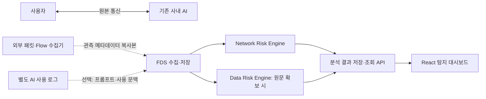

# Out-of-Path FDS 백엔드

**원본 트래픽은 그대로 흐르고, FDS는 별도로 수집한 복사본을 사후 분석합니다.** 사용자와 AI 사이에서 요청을 전달하거나 허용·차단하지 않습니다. FastAPI + SQLite 기반 백엔드 기본 틀입니다.


```mermaid
flowchart LR
    U[사용자] <-->|원본 통신| AI[기존 사내 AI]
    C[외부 패킷·Flow 수집기] -.->|관측 메타데이터 복사본| F[FDS 수집·저장]
    L[별도 AI 사용 로그] -.->|선택: 프롬프트·사용 문맥| F
    F --> N[Network Risk Engine]
    F --> D[Data Risk Engine: 원문 확보 시]
    N --> R[분석 결과 저장·조회 API]
    D --> R
    R --> UI[React 탐지 대시보드]
```

수집기는 미러링된 트래픽이나 저장된 캡처를 읽어 API 계약에 맞는 JSON으로 전달하는 외부 구성 요소입니다. 이 저장소가 NIC에서 패킷을 캡처하거나 PCAP 파일을 직접 해석하지는 않습니다. 수집기를 원본 요청 경로와 분리해야 FDS 장애나 분석 지연이 원본 AI 통신을 멈추지 않습니다.

## 현재 구현

관측된 세션·선택적인 AI 사용 로그 수신, 사용자·단말·세션·시간 연결 검증, 관측 자료 우선 저장, 최근 5분/1시간 집계, Data/Network 엔진 연결, 재전송 중복 방지, 결과·통계 조회를 구현했습니다.

실제 탐지 모델은 미연결입니다. `status: pending`, `score: null`, `final_grade: unassessed`는 안전 판정이 아닙니다. `processing_state: finished`는 이번 처리 과정 종료를 의미하며 모든 위험 항목의 실제 모델 분석 완료를 뜻하지 않습니다.

## 설치·실행

Python 3.12와 Git이 설치된 Windows에서 저장소 루트 기준:

```powershell
cd backend
py -3.12 -m venv .venv
.\.venv\Scripts\python.exe -m pip install -r requirements-dev.txt
.\.venv\Scripts\python.exe -m uvicorn app.main:app --host 127.0.0.1 --port 8000
```

백엔드는 **FDS 서버 하나**를 실행합니다. 대시보드는 별도 터미널에서 `frontend`의 `npm ci`, `npm run dev`로 실행합니다. [프론트엔드 실행 안내](../frontend/README.md)를 참고하세요.

- API 테스트 화면: http://127.0.0.1:8000/docs
- 상태: http://127.0.0.1:8000/health
- 기본 DB: `backend/data/passive-fds.sqlite3`
- DB 변경: 서버 시작 전 `$env:DATABASE_PATH = '원하는파일경로'`
- 브라우저 조회 허용 주소: `CORS_ORIGINS` (기본 `http://localhost:3000,http://localhost:5173`)

## 관측 자료 전송

`POST /api/v1/ingest/captures`에 다음처럼 보냅니다. AI 사용 명령이 아니라 이미 관측한 통신 기록의 복사본입니다.

```json
{
  "id": "capture-001",
  "session": {
    "id": "flow-001",
    "user_id": "employee-1",
    "device_id": "pc-1",
    "started_at": "2026-09-28T10:00:00+09:00",
    "ended_at": "2026-09-28T10:00:01+09:00",
    "destination": "local-ai.internal",
    "bytes_sent": 1024,
    "bytes_received": 2048,
    "source": "packet_capture"
  }
}
```

프롬프트가 없어도 Network 분석은 진행합니다. `ai_event`와 `prompt`는 선택 항목입니다. 프롬프트를 확보했다면 같은 세션에 연결된 `ai_event`와 함께 전송합니다. `/docs`의 스키마와 `examples/passive_demo.py`에 예시가 있습니다.

HTTPS 패킷 메타데이터만으로 프롬프트 원문이나 로그인 사용자를 알아낼 수는 없습니다. 프롬프트는 별도 앱 로그에서 확보하고, 사용자·단말은 수집기가 자산/사용자 매핑을 통해 연결해야 합니다. 미식별 대상은 실제 직원 계정처럼 만들지 말고 수집기에서 구분 가능한 관측용 식별자를 사용합니다.

`via_gateway`는 기존 네트워크 경로의 관측값이며 FDS 제어 설정이 아닙니다. 미확인이면 생략/null로 보내며, 미확인을 우회 접속으로 집계하지 않습니다. `connection_action`과 이벤트의 `policy_action`도 외부 시스템에서 관측한 값이고 이 서버가 실행하는 명령이 아닙니다.

## 조회 API

| Method | 경로 | 역할 |
|---|---|---|
| POST | `/api/v1/ingest/captures` | 관측 자료 저장 후 사후 분석 |
| GET | `/api/v1/captures` | 수집 기록·프롬프트 확보 상태 |
| GET | `/api/v1/assessments` | 캡처별 분석 묶음 |
| GET | `/api/v1/assessments/{capture_id}` | Data 1개 + Network 5분/1시간 2개 결과 |
| POST / GET | `/api/v1/network-sessions` | 세션 개별 등록/조회 |
| POST / GET | `/api/v1/ai-usage-events` | AI 사용 이벤트 개별 등록/조회 |
| POST / GET | `/api/v1/behavior-windows` | 지정 구간 집계 생성/조회 |
| POST | `/api/v1/data-risk/analyze` | 독립 프롬프트 분석 |
| POST | `/api/v1/network-risk/analyze/{window_id}` | 독립 행동 집계 분석 |
| GET | `/api/v1/risks`, `/api/v1/risks/{risk_id}` | 엔진 결과 목록/상세 |
| GET | `/api/v1/dashboard/summary` | 수집량·분석 건수·완료 점수 평균 |
| GET | `/api/v1/dashboard/events` | 캡처별 화면 데이터와 전체 건수 |
| GET | `/api/v1/dashboard/explanation?capture_id=...` | 저장된 분석 근거 요약 |

목록은 `user_id`, `limit`(기본 50, 최대 200), `offset`을 지원합니다. 개별 세션/이벤트 등록은 저장만 수행합니다. 자동 분석은 캡처 수집 API에서 실행합니다. 대시보드 평균은 완료된 엔진 호출 점수의 단순 평균이며 통합 등급이 아닙니다. React 화면은 `dashboard/events`로 최근 200건을 조회합니다. 개별 세션 등록만 한 기록은 캡처 분석 목록에 나타나지 않습니다.

## 수집·분석 처리 기준

수집기는 완료된 세션을 안정적인 ID로 전송하고 재시도 시 같은 ID와 내용을 보내야 합니다. 같은 캡처 ID·내용은 결과를 중복 저장하지 않습니다. 동일 ID의 내용 변경이나 기존 세션/이벤트 ID 충돌은 409, 잘못된 연결/입력은 422, 없는 결과는 404입니다. 스트리밍 Flow 갱신·여러 캡처에 걸친 세션 병합은 미지원입니다.

관측 자료와 `processing` 상태를 먼저 커밋한 뒤 분석합니다. 앞선 모델 실행이 느려도 이미 수집된 기록은 다음 집계에 포함될 수 있습니다. 세션과 이벤트는 같은 조회 시점으로 읽습니다. 분석 중 프로세스가 종료됐다면 수집기가 같은 자료를 재전송해 재시도할 수 있습니다. 동시 재전송으로 모델이 중복 실행될 수는 있지만 결과는 한 번만 저장됩니다.

수집 API는 분석까지 수행한 뒤 응답합니다. 이것은 원본 AI 통신과 분리된 수집기→FDS 통신입니다. 수집기 버퍼·영속 작업 큐·자동 재시도는 별도 구현 대상입니다.

집계는 관측 세션 종료 시각 기준 최근 5분/1시간을 봅니다. 세션 전송량은 시작 시각에 귀속합니다. 긴 세션의 바이트 분할, 늦게 도착한 기록으로 과거 결과 재계산, 개인별 기준선은 후속 구현 영역입니다.

## 프롬프트·모델 연결

원문은 앞뒤 공백·개행을 보존해 모델에 전달하며 DB에는 저장하지 않습니다. 수집 입력 상한은 131,072자, 현재 Data 모델 계약은 16,384자입니다. 모델 상한을 넘는 관측은 메타데이터를 저장하고 `prompt_too_large`로 표시합니다. 수집 상한보다 큰 원문은 수집기에서 생략하고 메타데이터만 보내야 합니다. 원문이 없거나 비어 있으면 Data 모델을 호출하지 않습니다.

`app/engines.py`의 `DataRiskEngine.analyze(request)`와 `NetworkRiskEngine.analyze(window)`를 구현해 `app/main.py`의 `create_app()`에 전달합니다. 학습 때의 전처리·특징 순서·점수 의미를 유지하고 원문을 결과 근거에 그대로 복사하지 않도록 구현합니다. 자세한 연결 위치는 한국어 코드 주석을 참고하세요.

실제 ML 모델, 통합 등급 정책, 캡처/Flow 변환기, 프롬프트 로그 연계, 관리자 인증·권한은 후속 작업입니다. 대시보드 화면과 저장 결과 요약은 연결돼 있습니다. 생성형 AI 호출·차단·제어 명령 API는 없습니다.

## 이전 Gateway 버전에서 변경된 점

- `app.gateway`, `app.gateway_clients`, `app.demo_model`과 관련 데모·테스트를 제거했습니다.
- `/api/v1/ingest/gateway`를 `/api/v1/ingest/captures`로 교체했습니다. 요청 JSON도 변경됐습니다.
- 기본 DB를 `passive-fds.sqlite3`로 분리했습니다. 기존 `backend.sqlite3`와 `gateway.sqlite3`는 삭제하거나 자동 변환하지 않습니다.
- 사용자 필터는 인증이 아닙니다. 로컬 개발용이며 사내 공개 전 수집기 인증과 관리자 권한을 구현해야 합니다.

## 검증

```powershell
.\.venv\Scripts\python.exe -m pytest -q
# FDS가 실행 중일 때 별도 터미널에서 관측 예시 전송
.\.venv\Scripts\python.exe examples/passive_demo.py
```

데모는 가상 캡처 메타데이터와 앱 로그를 전송합니다. 실제 트래픽 생성·패킷 캡처·AI 호출은 하지 않습니다. 반복 실행 시 새 ID로 기록이 추가됩니다.
