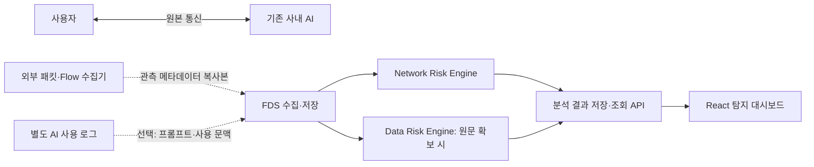

# Out-of-Path FDS 백엔드

**원본 트래픽은 그대로 흐르고, FDS는 별도로 수집한 복사본을 사후 분석합니다.** 사용자와 AI 사이에서 요청을 전달하거나 허용·차단하지 않습니다. FastAPI + SQLite 기반 백엔드 기본 틀입니다.


```mermaid
flowchart LR
    U[사용자] <-->|원본 통신| AI[기존 사내 AI]
    C[외부 패킷·Flow 수집기] -.->|관측 메타데이터 복사본| F[FDS 수집·저장]
    L[별도 AI 사용 로그] -.->|선택: 프롬프트·사용 문맥| F
    F --> N[Network Risk Engine]
    F --> D[Data Risk Engine: 원문 확보 시]
    N --> R[분석 결과 저장·조회 API]
    D --> R
    R --> UI[React 탐지 대시보드]
```

수집기는 미러링된 트래픽이나 저장된 캡처를 읽어 API 계약에 맞는 JSON으로 전달하는 외부 구성 요소입니다. 이 저장소가 NIC에서 패킷을 캡처하거나 PCAP 파일을 직접 해석하지는 않습니다. 수집기를 원본 요청 경로와 분리해야 FDS 장애나 분석 지연이 원본 AI 통신을 멈추지 않습니다.

## 현재 구현

관측된 세션·선택적인 AI 사용 로그 수신, 사용자·단말·세션·시간 연결 검증, 관측 자료 우선 저장, 최근 5분/1시간 집계, Data/Network 엔진 연결, 재전송 중복 방지, 결과·통계 조회를 구현했습니다.

All_in_one 프롬프트 모델(TF-IDF + XGBoost 네 분류기)과 [`model/network`](../model/network/)의 XGBoost Network 모델(5분 구간)을 연결했습니다. 통합 등급 정책은 아직 미연결입니다. 프롬프트 분류가 완료되어도 위험 점수는 `null`이며 각 항목의 `detected`, `probability`, `threshold`로 결과를 제공합니다. `NETWORK_ENGINE=stub` 또는 `PROMPT_ENGINE=stub`으로 서버를 시작하면 해당 엔진은 Stub을 씁니다. `status: pending`, `final_grade: unassessed`는 안전 판정이 아닙니다. `processing_state: finished`는 이번 처리 과정 종료를 의미하며 모든 위험 항목의 실제 모델 분석 완료를 뜻하지 않습니다.

## 설치·실행

Python 3.12와 Git이 설치된 Windows에서 저장소 루트 기준:

```powershell
cd backend
py -3.12 -m venv .venv
.\.venv\Scripts\python.exe -m pip install -r requirements-dev.txt
.\.venv\Scripts\python.exe -m uvicorn app.main:app --host 127.0.0.1 --port 8000
```

백엔드는 **FDS 서버 하나**를 실행합니다. 대시보드는 별도 터미널에서 `frontend`의 `npm ci`, `npm run dev`로 실행합니다. [프론트엔드 실행 안내](../frontend/README.md)를 참고하세요.

- API 테스트 화면: http://127.0.0.1:8000/docs
- 상태: http://127.0.0.1:8000/health
- 기본 DB: `backend/data/passive-fds.sqlite3`
- DB 변경: 서버 시작 전 `$env:DATABASE_PATH = '원하는파일경로'`
- 브라우저 조회 허용 주소: `CORS_ORIGINS` (기본 `http://localhost:3000,http://localhost:5173`)

기본 실행은 `models/all-in-one`의 모델을 서버 시작 시 한 번 불러옵니다. 요청마다 학습하지 않습니다. `/health`의 `data_engine: AllInOneDataRiskEngine`과 `prompt_model_version`으로 연결 상태를 확인합니다. 모델 파일 누락·해시 불일치·라이브러리 버전 불일치 시 시작을 실패시키며 Stub으로 몰래 바꾸지 않습니다. 모델 없이 수집 기능만 확인하려면 시작 전에 `$env:PROMPT_ENGINE = 'stub'`을 지정하고, 실제 모델로 복귀하려면 `Remove-Item Env:PROMPT_ENGINE` 후 재시작합니다. 다른 모델 폴더는 `PROMPT_MODEL_DIR`로 지정할 수 있습니다.

## 관측 자료 전송

### 이벤트 발생 즉시 전송 (권장)

`POST /api/v1/ingest/events`는 세션 종료를 기다리지 않습니다. 수집기나 사내 AI 앱의 별도 로그 전송 경로에서 요청 발생 시 아래와 같이 관측 이벤트를 보냅니다.

```json
{
  "id": "event-001",
  "session_id": "ongoing-session-001",
  "user_id": "employee-1",
  "device_id": "pc-1",
  "occurred_at": "2026-10-04T10:00:00+09:00",
  "destination": "local-ai.internal",
  "source": "application_log",
  "provider": "internal-ai",
  "channel": "api",
  "bytes_sent": 100,
  "bytes_received": 0,
  "prompt": {"text": "회의록을 요약해 주세요.", "input_origin": "direct_user"}
}
```

같은 통신의 다음 이벤트는 같은 `session_id`와 새로운 `id`를 사용합니다. 재전송만 기존 이벤트 ID와 동일한 내용을 사용합니다. 바이트는 **이번 관측의 증가량**이며 누적 전송량을 반복해서 보내면 안 됩니다. 같은 세션의 이벤트들은 바이트·요청 수는 누적하되 세션 수는 한 번만 셉니다. 캡처 경로와 이벤트 경로에 같은 트래픽을 중복 등록하지 마세요.

Network 모델 입력용 선택 항목: `packets_sent`, `packets_received`(증가량), `request_bytes`(HTTP 본문 크기, 생략 시 `bytes_sent`), `file_count`, `process_name`, `tenant`, `completed_at`(응답 완료 시각), `retry_after_block`. `provider`가 있을 때만 AI 사용 로그 항목을 받습니다(패킷 수 제외). 모델은 AI 사용 로그가 있는 5분 구간만 점수를 내며, 로그 없는 구간과 60분 구간은 `pending`입니다. 자세한 피처 정의는 [model/network README](../model/network/README.md#백엔드-연결)를 참고하세요.

`provider`와 `prompt`는 선택 항목입니다. 프롬프트가 있으면 `source: application_log`와 `provider`가 필요합니다. 네트워크 메타데이터만 있는 경우에는 두 필드를 생략할 수 있습니다. 내부 저장용 관측 ID와 원래 `session_id`를 분리하며, 대시보드는 원래 세션 ID를 보여줍니다. 기본 세션 조회의 `parent_session_id`로 원래 세션을 확인할 수 있습니다.

자료 저장 후 Data, Network 5분, Network 60분 분석을 병렬 호출하고 **완료되는 엔진부터 결과를 저장**합니다. 전체 작업이 끝나기 전에도 `processing_state: processing`과 부분 결과를 조회할 수 있습니다. 5분·60분은 실행 간격이 아니라 과거 행동을 참고하는 범위입니다. 모델 어댑터는 동시에 호출될 수 있으므로 공유 상태를 안전하게 관리해야 합니다.

대시보드는 `GET /api/v1/dashboard/stream`의 SSE 변경 알림을 받아 결과를 재조회합니다. 서버는 공유 SQLite 변경 번호를 0.25초 간격으로 확인하고 변경 시 알림을 보냅니다. 이는 분석 대기 시간이 아니며 실제 표시 지연에는 수집·모델 실행·DB·네트워크 시간이 더해집니다. 스트림은 원문이나 사용자 정보를 보내지 않으며, 재접속 시 최신 목록을 재조회합니다. 개별 알림 이력을 재생하는 기능은 아닙니다. 프록시 배포 시 SSE 응답 버퍼링을 끄고 장기 연결을 허용해야 합니다.

수집 API 응답은 전체 분석 후 반환됩니다. 원본 AI 통신과 분리된 수집기에서 전송하고, AI 요청 경로가 이 API의 응답을 기다리게 하지 마세요. 큐·자동 재시도·추론 시간 제한·부하 제어는 후속 구현 대상입니다. 처리 중 프로세스가 종료되면 같은 이벤트를 재전송해야 하며, 저장된 부분 결과를 유지하고 나머지를 확정합니다.

```powershell
.\.venv\Scripts\python.exe examples/event_demo.py
```

### 완료된 세션을 전송하는 기존 경로

`POST /api/v1/ingest/captures`에 다음처럼 보냅니다. AI 사용 명령이 아니라 이미 관측한 통신 기록의 복사본입니다.

```json
{
  "id": "capture-001",
  "session": {
    "id": "flow-001",
    "user_id": "employee-1",
    "device_id": "pc-1",
    "started_at": "2026-09-28T10:00:00+09:00",
    "ended_at": "2026-09-28T10:00:01+09:00",
    "destination": "local-ai.internal",
    "bytes_sent": 1024,
    "bytes_received": 2048,
    "source": "packet_capture"
  }
}
```

프롬프트가 없어도 Network 분석은 진행합니다. `ai_event`와 `prompt`는 선택 항목입니다. 프롬프트를 확보했다면 같은 세션에 연결된 `ai_event`와 함께 전송합니다. `/docs`의 스키마와 `examples/passive_demo.py`에 예시가 있습니다.

HTTPS 패킷 메타데이터만으로 프롬프트 원문이나 로그인 사용자를 알아낼 수는 없습니다. 프롬프트는 별도 앱 로그에서 확보하고, 사용자·단말은 수집기가 자산/사용자 매핑을 통해 연결해야 합니다. 미식별 대상은 실제 직원 계정처럼 만들지 말고 수집기에서 구분 가능한 관측용 식별자를 사용합니다.

`via_gateway`는 기존 네트워크 경로의 관측값이며 FDS 제어 설정이 아닙니다. 미확인이면 생략/null로 보내며, 미확인을 우회 접속으로 집계하지 않습니다. `connection_action`과 이벤트의 `policy_action`도 외부 시스템에서 관측한 값이고 이 서버가 실행하는 명령이 아닙니다.

## 조회 API

| Method | 경로 | 역할 |
|---|---|---|
| POST | `/api/v1/ingest/events` | 세션 종료 없이 관측 이벤트 수신·분석 |
| GET | `/api/v1/dashboard/stream` | 수신·부분 결과·완료 시 SSE 변경 알림 |
| POST | `/api/v1/ingest/captures` | 관측 자료 저장 후 사후 분석 |
| GET | `/api/v1/captures` | 수집 기록·프롬프트 확보 상태 |
| GET | `/api/v1/assessments` | 캡처별 분석 묶음 |
| GET | `/api/v1/assessments/{capture_id}` | Data 1개 + Network 5분/1시간 2개 결과 |
| POST / GET | `/api/v1/network-sessions` | 세션 개별 등록/조회 |
| POST / GET | `/api/v1/ai-usage-events` | AI 사용 이벤트 개별 등록/조회 |
| POST / GET | `/api/v1/behavior-windows` | 지정 구간 집계 생성/조회 |
| POST | `/api/v1/data-risk/analyze` | 독립 프롬프트 분석 |
| POST | `/api/v1/network-risk/analyze/{window_id}` | 독립 행동 집계 분석 |
| GET | `/api/v1/risks`, `/api/v1/risks/{risk_id}` | 엔진 결과 목록/상세 |
| GET | `/api/v1/dashboard/summary` | 수집량·분석 건수·완료 점수 평균 |
| GET | `/api/v1/dashboard/events` | 캡처별 화면 데이터와 전체 건수 |
| GET | `/api/v1/dashboard/explanation?capture_id=...` | 저장된 분석 근거 요약 |

목록은 `user_id`, `limit`(기본 50, 최대 200), `offset`을 지원합니다. `/network-sessions`와 `/ai-usage-events`의 개별 등록은 저장만 수행합니다. 자동 분석은 `/ingest/captures`와 `/ingest/events`에서 실행합니다. 대시보드 평균은 완료된 엔진 호출 점수의 단순 평균이며 통합 등급이 아닙니다. React 화면은 `dashboard/events`로 최근 200건을 조회합니다. 개별 세션 등록만 한 기록은 캡처 분석 목록에 나타나지 않습니다.

## 수집·분석 처리 기준

기존 캡처 경로는 완료된 세션을 받고 새 이벤트 경로는 시점별 증가량을 받습니다. 두 경로는 관측 ID 공간을 공유하므로 수집기별 접두사를 권장합니다. 재전송은 같은 ID와 내용을 사용해야 합니다. 동일 ID의 내용 변경이나 기존 세션/이벤트 ID 충돌은 409, 잘못된 연결/입력은 422, 없는 결과는 404입니다. 기존 기록을 수정하는 누적 Flow 갱신은 미지원입니다.

관측 자료와 `processing` 상태를 먼저 커밋한 뒤 분석합니다. 앞선 모델 실행이 느려도 이미 수집된 기록은 다음 집계에 포함될 수 있습니다. 세션과 이벤트는 같은 조회 시점으로 읽습니다. 분석 중 프로세스가 종료됐다면 수집기가 같은 자료를 재전송해 재시도할 수 있습니다. 동시 재전송으로 모델이 중복 실행될 수는 있지만 결과는 한 번만 저장됩니다.

수집 API는 분석까지 수행한 뒤 응답합니다. 이것은 원본 AI 통신과 분리된 수집기→FDS 통신입니다. 수집기 버퍼·영속 작업 큐·자동 재시도는 별도 구현 대상입니다.

캡처 집계는 관측 세션 종료 시각 기준 최근 5분/1시간을 보며 전송량은 세션 시작 시각에 귀속합니다. 새 이벤트는 발생 시각에 증가량을 귀속합니다. 늦게 도착한 기록으로 과거 결과를 재계산하는 기능과 개인별 기준선은 후속 구현 영역입니다.

## 프롬프트·모델 연결

원문은 앞뒤 공백·개행을 보존해 모델에 전달하며 DB에는 저장하지 않습니다. 수집 입력 상한은 131,072자, 현재 Data 모델 계약은 16,384자입니다. 모델 상한을 넘는 관측은 메타데이터를 저장하고 `prompt_too_large`로 표시합니다. 수집 상한보다 큰 원문은 수집기에서 생략하고 메타데이터만 보내야 합니다. 원문이 없거나 비어 있으면 Data 모델을 호출하지 않습니다.

`app/prompt_engine.py`가 `request.text`를 모델에 전달합니다. 받은 노트북과 같은 NFKC·개행 정리·앞뒤 공백 제거, 공통 TF-IDF, 네 XGBoost 분류기, `probability > 0.5` 판정을 사용합니다. 네 항목은 `AI_steal`, `prompt_injection`, `abuse_act`, `token_waste_repeat`이며 복수 탐지가 가능합니다. 모든 항목 미탐지는 실제 안전·정책 준수를 보장하지 않습니다. `input_origin`은 결과에 보존하지만 기존 모델은 문장만 분류하므로 출처·업무 맥락을 학습 특징으로 사용하지 않습니다.

분류 결과 예시(형식 설명용 숫자):

```json
{"code":"AI_steal","name":"인공지능 증류","status":"complete","score":null,"detected":true,"probability":0.91,"threshold":0.5,"reason":"라벨 정의이며 개별 판단 근거는 미제공"}
```

`status: complete`는 점수가 없어도 분류 완료를 뜻할 수 있습니다. 예측 확률을 위험 점수로 변환하지 않고 엔진 평균·통합 등급에도 넣지 않습니다. 기존 점수형 엔진 출력과 과거 DB 기록은 계속 읽을 수 있습니다. 원문·예외 상세는 저장하지 않으며 표시되는 설명은 라벨 정의입니다.

실제 모델 → 수집 API → 저장 → 화면 연결 확인:

```powershell
.\.venv\Scripts\python.exe examples/prompt_model_demo.py
```

받은 원본에는 모델 체크포인트가 없어 기본 546,973건 구성으로 한 번 학습해 저장했습니다. 추가 보강 실험·튜닝·임계값 조정은 적용하지 않았습니다. 모델과 전처리 파일·해시는 `models/all-in-one/manifest.json`에 있습니다. 학습 데이터와 원본 노트북은 이 저장소에 복제하지 않았습니다. 동일 원본을 가진 팀원은 다음과 같이 새 폴더에 재생성할 수 있습니다.

```powershell
.\.venv\Scripts\python.exe scripts/train_prompt_model.py --source 'C:\경로\All_in_one' --output 'models/all-in-one-retrained'
```

학습 도구는 검토한 원본 노트북의 SHA-256을 확인하고 설정·전처리·학습 정의 셀만 실행합니다. 원본 CSV 수정, 전체 Run All, 테스트 기반 튜닝은 하지 않습니다. 소스가 바뀌면 해시만 바꾸지 말고 해당 코드를 재검토해야 합니다. TF-IDF joblib 파일은 신뢰하는 학습 절차에서 생성한 것만 배포합니다.

Network 엔진은 `app/network_model.py`가 [`model/network`](../model/network/)의 XGBoost 모델(5분 구간)을 불러와 연결합니다. `NETWORK_ENGINE=stub`으로 서버를 시작하면 Network는 Stub을 씁니다.

다른 엔진 연결은 `app/engines.py`의 `DataRiskEngine.analyze(request)`와 `NetworkRiskEngine.analyze(window)` 계약을 구현해 `create_app()`에 전달합니다.

현재 프롬프트 모델은 AI·규칙 잠정 라벨 기반 시범 모델이며 오탐 개선이나 실사용 성능 검증을 완료한 것이 아닙니다. 통합 등급 정책, 캡처/Flow 변환기, 프롬프트 로그 연계, 관리자 인증·권한은 후속 작업입니다. 생성형 AI 호출·차단·제어 명령 API는 없습니다.

## 이전 Gateway 버전에서 변경된 점

- `app.gateway`, `app.gateway_clients`, `app.demo_model`과 관련 데모·테스트를 제거했습니다.
- `/api/v1/ingest/gateway`를 `/api/v1/ingest/captures`로 교체했습니다. 요청 JSON도 변경됐습니다.
- 기본 DB를 `passive-fds.sqlite3`로 분리했습니다. 기존 `backend.sqlite3`와 `gateway.sqlite3`는 삭제하거나 자동 변환하지 않습니다.
- 사용자 필터는 인증이 아닙니다. 로컬 개발용이며 사내 공개 전 수집기 인증과 관리자 권한을 구현해야 합니다.

## 검증

```powershell
.\.venv\Scripts\python.exe -m pytest -q
# FDS가 실행 중일 때 별도 터미널에서 관측 예시 전송
.\.venv\Scripts\python.exe examples/passive_demo.py
```

데모는 가상 캡처 메타데이터와 앱 로그를 전송합니다. 실제 트래픽 생성·패킷 캡처·AI 호출은 하지 않습니다. 반복 실행 시 새 ID로 기록이 추가됩니다.
